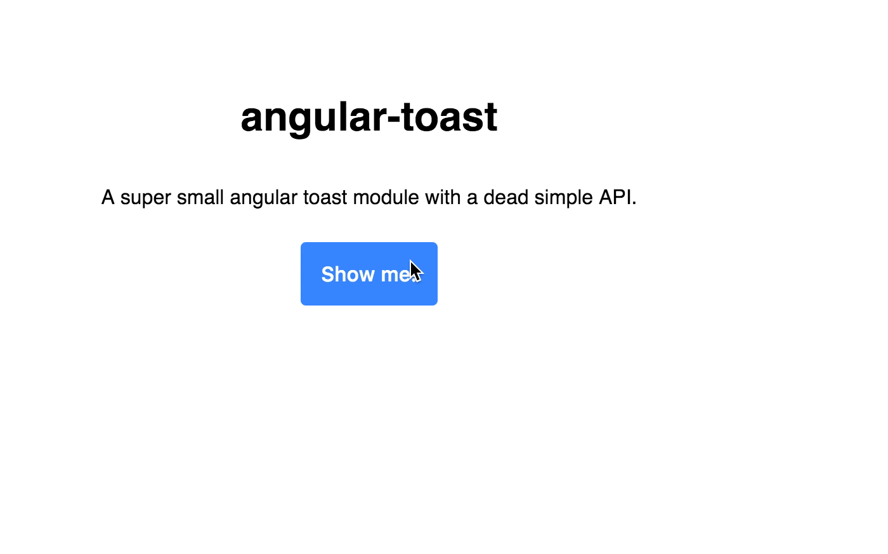

## angular-toast

I couldn't find a toast library that fit my needs and was reasonably small, so I ended up building one with a dead simple API and decided to share it. There is a *low* frame ```.gif``` at the bottom

[![NPM][toast-icon]][toast-url]

#### Installation  
Installation is super easy, simply add the dependencies to your build, inject it and call the ```toast.show()``` method.

```
# use npm
$ npm install angular-toast
```

Add angular-toast to your dependencies

```
angular
  .module('yourApp', ['angular-toast'])
  .controller('SampleController', function ($scope, toast) {

    $scope.test = function (text) {
      return toast.show(text || 'Example')
    }

  })
```

#### API
```toast.show(text, timeout)```  

The first parameter is your custom message, and the second *optional* parameter is a custom timeout in milliseconds (default is 4 seconds)




[toast-icon]: https://nodei.co/npm/angular-toast.png?downloads=true
[toast-url]: https://npmjs.org/package/angular-toast
